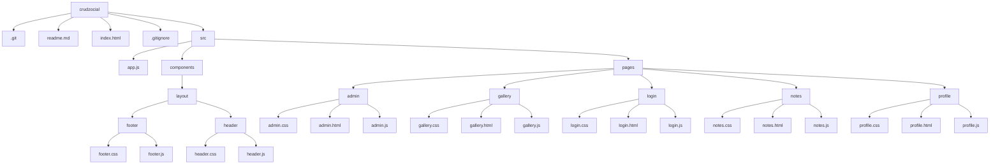

# Información General del Proyecto

- **Nombre del Proyecto:** Crudzocial-CtrlAltSupr 
- **Nombre del Equipo e Integrantes:**
  - Juan Carlos Balcero Torres.
  - Mariana Restrepo Acevedo.
  - Matius Monsalve.
  - Daniel Tapias.
- **Descripción del Sistema y Objetivo:**
  Crudzocial es una plataforma web que integra funcionalidades **CRUD** (Crear, Leer, Actualizar, Eliminar) con características **sociales**. Permite a los usuarios gestionar notas, compartir contenido, y mantener perfiles personalizados, resolviendo la necesidad de una gestión sencilla y colaborativa de información en entornos educativos o de trabajo.

---

# Tecnologías Utilizadas

- **Frontend:** HTML, CSS, JavaScript (Vanilla JS)
- **Framework de estilos:** [Bulma CSS](https://bulma.io/)
- **Web Components:** Utilizados para crear componentes reutilizables y modulares, facilitando el mantenimiento y la escalabilidad del sistema. Más información en [MDN Web Components](https://developer.mozilla.org/en-US/docs/Web/Web_Components).
- **Almacenamiento en frontend:** Uso de `localStorage` y `sessionStorage` para persistencia de datos y manejo de sesiones. También se simula una base de datos con arrays en JS.
- **Control de versiones:** Git y GitHub.


---

# Ejecución y Pruebas


## Instalación
```bash
git https://github.com/MatiusDev/crudzocial.git
cd crudzocial
```

## Ejecución
1. Abre el proyecto en VS Code.
2. Haz clic derecho en `index.html` y selecciona "Open with Live Server".
3. Accede a la aplicación desde tu navegador en `http://localhost:5500` (o el puerto que indique Live Server).

---

# Descripción de Funcionalidades

- **Login/Logout:** Flujo de autenticación de usuarios. Permite iniciar y cerrar sesión, diferenciando entre usuarios normales y administradores.
- **Galería:** Visualización de imágenes o publicaciones. Permite leer información y, según permisos, agregar o eliminar elementos.
- **Notas:** Gestión completa de notas (CRUD). Los usuarios pueden crear, leer, actualizar y eliminar sus notas.
- **Panel de Administración:** Acceso restringido a administradores para gestionar usuarios y contenido.
- **Perfil de Usuario:** Consulta y actualización de datos personales del usuario.

---

# Detalles Técnicos Clave

## Almacenamiento
- **localStorage:** Almacena datos persistentes como usuarios, notas y configuraciones.
- **sessionStorage:** Maneja información temporal de la sesión activa (usuario logueado, rol, etc.).
- **Ejemplo:**
  - Clave: `usuarios` → Valor: JSON con lista de usuarios.
  - Clave: `sessionUser` → Valor: usuario actualmente autenticado.

## Funciones y Modularidad
- El código está organizado en módulos ES6 (`import`/`export`), separando componentes, páginas y utilidades.
- Uso de Web Components para el header, footer y otros elementos reutilizables.
- Esta estructura facilita el mantenimiento y la escalabilidad del sistema.

## Manejo de Permisos
- Lógica para identificar el rol del usuario (admin o usuario normal) y restringir funcionalidades sensibles.
- Ejemplo: solo el admin puede acceder al panel de administración.

## Logs y Depuración
- Uso de `console.log()` para seguimiento de eventos y errores.
- Recomendación de utilizar las herramientas de desarrollador del navegador para inspección de DOM, estilos y consola.

---

# Aprendizajes del Equipo

- Retos enfrentados y soluciones implementadas durante el desarrollo.
- Nuevos conceptos y herramientas aprendidas: Web Components, manejo de Gitflow, modularidad en JS, uso de Bulma.
- Habilidades de colaboración y trabajo en equipo fortalecidas.

---

# Estructura del Proyecto

La siguiente imagen y diagrama muestran la organización de carpetas y archivos:

